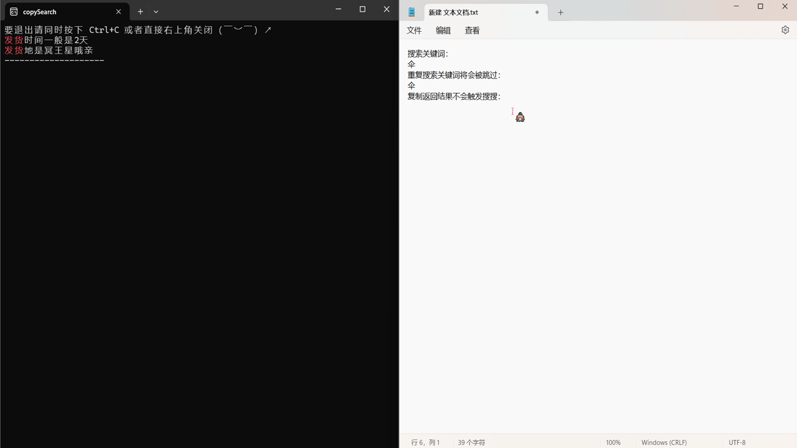

# 复制搜索工具

## 演示

## 功能介绍

- 使用语言：

  python-3.10.5

- 使用库：

| Package                   | Version  |
| ------------------------- | -------- |
| altgraph                  | 0.17.4   |
| packaging                 | 24.1     |
| pefile                    | 2023.2.7 |
| pip                       | 24.1.2   |
| PyGetWindow               | 0.0.9    |
| pyinstaller               | 6.9.0    |
| pyinstaller-hooks-contrib | 2024.7   |
| pyperclip                 | 1.9.0    |
| PyRect                    | 0.2.0    |
| pywin32-ctypes            | 0.2.2    |
| setuptools                | 58.1.0   |

- 基本功能：

  - 搜索：可自定义文本库，在进行复制操作时自动搜索文本库，并输出含有关键词的文本
  - 防重复：连续两次复制同一段文本不会触发搜索
  - 复制输出不触发：复制本次输出结果不触发搜索
  - 高亮：搜索词/关键字高亮

- 自定义：

  1. 关键词高亮：

     可选中在输出文本中，搜索词高亮或自定义关键字列表高亮

  2. 自定义延时：

     默认为1秒查询一次，可根据需求修改时间间隔

  3. 自定义文本库：

     需要被搜索的文本

## 运行

- exe运行：

  下载解压即可

- 源码运行：

  - 通过`pipinstall.txt`文件安装对应库

    ~~~shell
    pip install -r pipinstall.txt
    ~~~

  - 运行

    ~~~shell
    py main.py
    ~~~

## 配置文件

默认的配置文件`config.json`内容如下：

~~~json
{
    "sleep_time": 1,
    "keywords_enable": true,
    "keywords": [
        "是",
        "了",
        "亲"
    ],
    "texts": [
        "下雨了要打伞",
        "出太阳也可以打伞",
        "热了要开空调",
        "困了要睡觉",
        "发货时间一般是2天",
        "亲你好有什么需要帮助",
        "发货地是冥王星哦亲",
        "亲这边是发逆风快递哦"
    ]
}
~~~

~~~json
{
		"sleep_time":"必填-正整数-休眠时间，单位秒",
		"keywords_enable":"必填-布尔值-是否使用关键词高亮，设置为false则搜索词高亮",
		"keywords":"选填-字符串数组-如果启用了关键词高亮，请填入字符串数组的形式",
		"texts":"必填-字符串数组-文本库"
}
~~~

